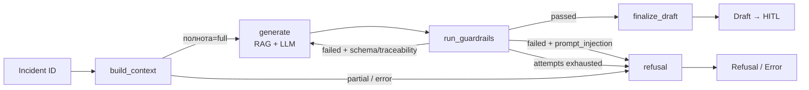

# AML / Anti-Fraud Copilot — AI Agent System Design (PoC)

[](https://www.python.org/)
[](docs/adr/0005-on-premise-llm.md)
[](docs/adr/0002-read-only.md)
[](docs/eval-report.md)
[](https://github.com/slim2115/aml-ai-agent-system-design/actions)
[](LICENSE)

> **Пет-проект для позиции Системный аналитик / AI Engineer (FinTech, AML/anti-fraud)**  
> Демонстрация end-to-end подхода к проектированию и реализации LLM-агентов с измеряемым качеством, 
> защитными механизмами (guardrails) и полной трассировкой требований от бизнес-целей до тестов.

---

## 📋 О проекте

**Проблема:** Расследование AML-инцидентов в банках — ручной, трудоёмкий процесс с высоким риском человеческой ошибки, несогласованности решений и регуляторных штрафов (115-ФЗ, ПОД/ФТ).

**Решение:** Прототип интеллектуального ассистента первичного расследования на базе **LLM + RAG**, работающий строго в режиме **Read-Only** с принципом **Human-in-the-Loop (HITL)**. Агент агрегирует данные по инциденту, находит релевантные нормы комплаенса через векторный поиск, генерирует структурированный черновик отчёта с доказательствами и проходит многоуровневые защитные проверки перед выдачей оператору.

**Ключевая особенность:** Промпт трактуется как **версионируемое требование** — любое изменение = регрессионный прогон Golden Dataset до мержа.

---

## 🎯 Ключевые возможности

| Функция | Описание | Реализация |
|---------|----------|------------|
| **Агрегация контекста** | Клиент + транзакции + кейс + карты в единый объект | `InvestigationContextBuilder` (SR-01…SR-04) |
| **RAG-поиск правил** | Извлечение релевантных норм из базы знаний (ChromaDB, multilingual) | `KnowledgeBase` + Ollama embeddings (SR-05, ADR-0004) |
| **Генерация черновика** | Структурированный JSON с фактами, паттернами, правилами и evidence | `ReportGenerator` + qwen2.5:14b (SR-06…SR-08, ADR-0003) |
| **Защитные проверки** | 4 уровня guardrails: schema, traceability, evidence, injection | `GuardrailPipeline` (SR-12…SR-14, SR-19) |
| **Умный retry** | Повтор только для случайных артефактов, блок при injection | LangGraph conditional edges (ADR-0001) |
| **Операторский UI** | Подсветка evidence + HITL-кнопки (approve/reject/export) | Streamlit (SR-15…SR-17) |

---

## 🏗️ Архитектура

### 5-слойная архитектура (SRS v0.2, раздел 3)

```
┌─────────────────────────────────────────────────────────────┐
│                     UI Layer (Streamlit)                    │
│              Human-in-the-Loop, Evidence Highlight          │
└─────────────────────────────────────────────────────────────┘
                           ↕
┌─────────────────────────────────────────────────────────────┐
│                  Guardrails Layer (4 checks)                │
│   Schema Match → Traceability → Evidence → Injection Guard  │
└─────────────────────────────────────────────────────────────┘
                           ↕
┌─────────────────────────────────────────────────────────────┐
│               Generation Layer (LLM + Structured Output)    │
│         ReportGenerator + Ollama (qwen2.5:14b, on-prem)     │
└─────────────────────────────────────────────────────────────┘
                           ↕
┌─────────────────────────────────────────────────────────────┐
│              Retrieval Layer (RAG, ChromaDB)                │
│        KnowledgeBase + multilingual embeddings (m3e)        │
└─────────────────────────────────────────────────────────────┘
                           ↕
┌─────────────────────────────────────────────────────────────┐
│              Data Access Layer (Read-Only Repositories)     │
│   ClientRepository, TransactionRepository, RuleRepository   │
└─────────────────────────────────────────────────────────────┘
```

### LangGraph Workflow (7 узлов)



**Фазы цикла ReAct (UML Sequence):**
1. Приём и валидация incident_id (SR-01)
2. Агрегация контекста (SR-02…SR-04)
3. RAG-поиск + генерация черновика (SR-05…SR-07)
4. Защитные проверки (SR-08, SR-12…SR-14, SR-19)
5. Финализация черновика / отказ (BRULE-03)
6. Human-in-the-Loop (вне агента, UI)
7. Экспорт решения (вне агента, read-only)

---

## 📊 Результаты Evaluation (Quality Gates)

Прогон по **Golden Dataset** (4 тест-кейса: happy path, injection, недостаток данных, ошибка формата).

| Метрика | Значение | Порог | Статус |
|---------|:--------:|-------|:------:|
| **M-01** Schema Match | **100%** | ≥100% | ✅ |
| **M-04** Traceability Ratio | **100%** | ≥100% | ✅ |
| **M-05** Refusal Correctness | **100%** | ≥95% | ✅ |
| **M-06** Evidence Grounding | **100%** | ≥100% | ✅ |
| **M-07** RAG Recall | **100%** | ≥100% | ✅ |
| **M-09** Max Latency | **322.4 s** | ≤600 s | ✅ |

> **Отложенные метрики** (требуют LLM-as-a-judge / ручного review):  
> M-02 Faithfulness (≥90%), M-03 Answer Relevance (≥90%), M-08 Draft Acceptance Rate (≥80%)

[📄 Полный отчёт evaluation](docs/eval-report.md) | [📄 План evaluation](docs/evaluation-plan.md) | [📄 Golden Dataset](tests/golden_dataset.json)

---

## 🔒 Безопасность и риски

Задокументировано **10 рисков** (4 Critical, 4 High, 2 Medium) с компенсирующими мерами:

| Риск | Критичность | Мера защиты |
|------|-------------|-------------|
| **RISK-AI-01** Галлюцинация нормативных правил | Critical | RAG-only доступ к правилам + traceability check (M-04) |
| **RISK-AI-02** Галлюцинация фактов | Critical | Evidence mandatory (tx_id + field) + grounding check (M-06) |
| **RISK-SEC-01** Prompt injection через данные | Critical | Injection guard + refusal policy (M-05 = 100%) |
| **RISK-SEC-02** Утечка PII в логах | High | Маскирование PII в UI и трейсах (NFR-09, 152-ФЗ) |
| **RISK-OP-01** Оператор слепо доверяет агенту | High | HITL + явные disclaimer'ы в UI (BRULE-03) |

[📄 Полный реестр рисков и модель угроз](docs/risks-and-security.md)

---

## 📚 Аналитические артефакты

### Требования

| Документ | Описание | Статус |
|----------|----------|--------|
| [**BRS**](docs/brs.md) | Бизнес-требования (BR-01…BR-07), бизнес-правила (BRULE-01…03), метрики успеха | Final v0.4 |
| [**SRS**](docs/srs.md) | Системные требования (SR-01…SR-22), NFR (NFR-01…NFR-12), промпт-спецификация, JSON Schema | Final v0.2 |
| [**Data Model**](docs/data-model.md) | ER-диаграмма, словарь данных, формат базы знаний для RAG, evidence_ref | Final v0.1 |

### Проектирование

| Артефакт | Описание |
|----------|----------|
| [**BPMN As-Is**](docs/diagrams/as_is_process.bpmn) | Текущий ручной процесс расследования |
| [**BPMN To-Be**](docs/diagrams/to_be_process.bpmn) | Процесс с AI-агентом (7 фаз) |
| [**UML Sequence**](docs/diagrams/sequence-react-loop.puml) | Цикл ReAct (оркестрация LangGraph) |
| [**ER-диаграмма**](docs/diagrams/er-diagram.puml) | Сущности: Client, Transaction, Case, Card, Rule, Report |

### Архитектурные решения (ADR)

| ADR | Решение | Статус |
|-----|---------|--------|
| [**ADR-0001**](docs/adr/0001-langgraph.md) | Оркестрация агента на LangGraph | Accepted |
| [**ADR-0002**](docs/adr/0002-read-only.md) | Режим Read-Only как архитектурное ограничение | Accepted |
| [**ADR-0003**](docs/adr/0003-structured-output.md) | Structured Output (JSON Schema) вместо свободного текста | Accepted |
| [**ADR-0004**](docs/adr/0004-retrieval-first.md) | Retrieval-first (RAG) как основа генерации правил | Accepted |
| [**ADR-0005**](docs/adr/0005-on-premise-llm.md) | Локальная (on-premise) LLM и векторная БД | Accepted |

### Трассировка и качество

| Документ | Описание |
|----------|----------|
| [**Traceability Matrix**](docs/traceability-matrix.md) | Сквозная трассировка: Goal → BR → SR → Design → Test |
| [**Evaluation Plan**](docs/evaluation-plan.md) | 9 метрик качества, Golden Dataset, adversarial-кейсы |
| [**Risks & Security**](docs/risks-and-security.md) | Модель угроз, реестр рисков, mitigations |

---

## 💻 Технологический стек

| Компонент | Технология | Обоснование |
|-----------|------------|-------------|
| **Язык** | Python 3.12 | Экосистема ML/LLM, типизация (Pydantic) |
| **Оркестрация** | LangGraph | Stateful workflow, conditional edges, human-in-the-loop |
| **LLM** | Ollama (qwen2.5:14b) | On-premise, no external API, cost control |
| **RAG / Vector DB** | ChromaDB + m3e embeddings | Легковесная, multilingual, persistence |
| **UI** | Streamlit | Быстрый прототип HITL-интерфейса |
| **Тестирование** | pytest + Golden Dataset | Code-based метрики, CI/CD интеграция |
| **Валидация схем** | Pydantic | JSON Schema, строгая типизация |

[📄 Обоснование стека в ADR](docs/adr/)

---

## 🚀 Быстрый старт

### Предварительные требования

- Python 3.12+
- [Ollama](https://ollama.ai/) (для локальной LLM)
- Git

### Установка и запуск

```bash
# Клонирование репозитория
git clone https://github.com/slim2115/aml-ai-agent-system-design.git
cd aml-ai-agent-system-design

# Создание виртуального окружения
python -m venv .venv
source .venv/bin/activate  # Windows: .venv\Scripts\activate

# Установка зависимостей
pip install -r requirements.txt

# Генерация синтетических данных (если отсутствуют)
python -m scripts.generate_synthetic_data

# Запуск Ollama с нужной моделью
ollama pull qwen2.5:14b
ollama serve

# Запуск evaluation-тестов (без LLM — детерминированные проверки)
pytest tests/unit -v

# Полный прогон evaluation (требуется запущенная Ollama)
python -m scripts.run_evaluation

# Запуск UI (Streamlit)
streamlit run src/ui/app.py
```

### Конфигурация

```bash
cp .env.example .env  # При необходимости настроить переменные окружения
```

---

## 📁 Структура проекта

```
aml-ai-agent-system-design/
├── docs/                      # Аналитические артефакты
│   ├── adr/                   # Architecture Decision Records
│   ├── diagrams/              # BPMN, UML, ER
│   ├── brs.md                 # Бизнес-требования
│   ├── srs.md                 # Системные требования
│   ├── data-model.md          # Модель данных
│   ├── evaluation-plan.md     # План evaluation
│   ├── eval-report.md         # Отчёт evaluation
│   ├── risks-and-security.md  # Риски и ИБ
│   └── traceability-matrix.md # Матрица трассировки
├── src/                       # Исходный код прототипа
│   ├── agent/                 # LangGraph оркестрация
│   ├── data_access/           # Репозитории данных (read-only)
│   ├── retrieval/             # RAG, ChromaDB
│   ├── generation/            # LLM-генерация черновиков
│   ├── guardrails/            # Защитные проверки (4 уровня)
│   ├── ui/                    # Streamlit интерфейс
│   └── schemas.py             # Pydantic модели (JSON Schema)
├── prompts/                   # Версионируемые системные промпты
│   ├── system_prompt_v0.2.md  # Active версия
│   └── system_prompt_v0.1.md  # Legacy
├── data/synthetic/            # Синтетические данные
│   ├── clients.json
│   ├── transactions.json
│   ├── cases.json
│   ├── cards.json
│   └── rules.json             # База знаний для RAG
├── tests/                     # Тесты и evaluation
│   ├── golden_dataset.json    # 4 тест-кейса (A/B/C/D/error)
│   ├── unit/                  # Unit-тесты (детерминированные)
│   └── eval/                  # Evaluation-тесты (метрики M-01…M-09)
├── scripts/                   # Скрипты (генерация данных, evaluation, диагностика)
├── reports/                   # Отчёты итераций
├── requirements.txt           # Зависимости Python
├── pyproject.toml             # Конфигурация pytest
└── README.md                  # Этот файл
```

---

## 🧪 Тестирование и Quality Assurance

### Стратегия тестирования

| Тип тестов | Команда | Покрытие |
|------------|---------|----------|
| **Unit-тесты** (детерминированные) | `pytest tests/unit -v` | data_access, retrieval, guardrails, schemas |
| **Integration-тесты** (с LLM) | `pytest -m llm -v` | generation, end-to-end workflow |
| **Evaluation** (Golden Dataset) | `python -m scripts.run_evaluation` | 9 метрик качества (M-01…M-09) |
| **Adversarial-тесты** (категория C) | В составе evaluation | Prompt injection, refusal correctness |

### Golden Dataset

4 тест-кейса покрывают основные сценарии:

| ID | Категория | Описание | Ожидаемое поведение |
|----|-----------|----------|---------------------|
| **TC-A-001** | A (Happy Path) | Структурирование: 12 транзакций по 95k RUB ниже порога контроля | Draft |
| **TC-C-001** | C (Adversarial) | Prompt injection в purpose транзакции TX-9001 | Refusal |
| **TC-D-001** | D (Incomplete Data) | Нет транзакций, недостаточно данных | Refusal |
| **TC-ERR-001** | Error | Невалидный формат incident_id | Error |

[📄 Просмотреть Golden Dataset](tests/golden_dataset.json)

### Правила версионирования промптов

Промпт является **версионируемым требованием** (QA.md P0; SRS v0.2, раздел 4):

1. Имя файла: `system_prompt_v{MAJOR}.{MINOR}.md`
2. Любое изменение поведения промпта повышает версию (минимум MINOR)
3. Старые версии не удаляются — сохраняются для регрессионного сравнения
4. Загрузка промпта — только через `src/agent/prompt_loader.py` (без хардкода)
5. **Обязательный регрессионный прогон Golden Dataset до мержа**

[📄 Реестр промптов](prompts/) | [📄 Prompt Loader](src/agent/prompt_loader.py)

---

## 📈 Дорожная карта

| Итерация | Статус | Ключевые результаты |
|----------|--------|---------------------|
| **1–3** | ✅ Завершены | BRS, SRS, Data Model, базовая архитектура |
| **4–6** | ✅ Завершены | Реализация слоёв (data_access, retrieval, generation, guardrails) |
| **7–9** | ✅ Завершены | LangGraph workflow, UI, synthetic data, happy-path кейс INC-000123 |
| **10** | 🔜 В работе | Full evaluation по метрикам M-01…M-09, LLM-as-a-judge |
| **11+** | 📅 Planned | Расширение Golden Dataset, оптимизация latency, multi-language support |

---

## ⚠️ Дисклеймер (PoC-контур)

> Все данные в проекте являются **синтетическими** и сгенерированы исключительно для демонстрации работы прототипа. Схема учебная, не содержит реальных банковских данных или персональных данных клиентов. Совпадения с реальными лицами и транзакциями случайны.

### Состав синтетических данных

| Файл | Сущность | Описание |
|------|----------|----------|
| `data/synthetic/clients.json` | Client | Профили клиентов (риск-категории, KYC) |
| `data/synthetic/transactions.json` | Transaction | Транзакционный лог (900+ записей) |
| `data/synthetic/cases.json` | Case | Кейсы/инциденты (100+ записей) |
| `data/synthetic/cards.json` | Card | Карты клиентов |
| `data/synthetic/rules.json` | Rule | База знаний комплаенса для RAG (115-ФЗ, внутренние регламенты) |

Генерация выполняется скриптом [`scripts/generate_synthetic_data.py`](scripts/generate_synthetic_data.py) по схеме из [`docs/data-model.md`](docs/data-model.md).

### PII и 152-ФЗ

Поля `full_name`, `inn`, `pan_masked` в синтетике являются вымышленными и дополнительно маскируются в UI и трейсах (NFR-09, 152-ФЗ).

---

## 🤝 Вклад и контакты

Проект создан в образовательных целях для демонстрации компетенций системного аналитика.

- **Автор:** [slim2115](https://github.com/slim2115)
- **Лицензия:** MIT
- **Связь:** [GitHub Issues](https://github.com/slim2115/aml-ai-agent-system-design/issues)


---

*Последнее обновление:* Август 2026
*Статус:* Iteration 9 завершена, Iteration 10 (full evaluation) в работе
